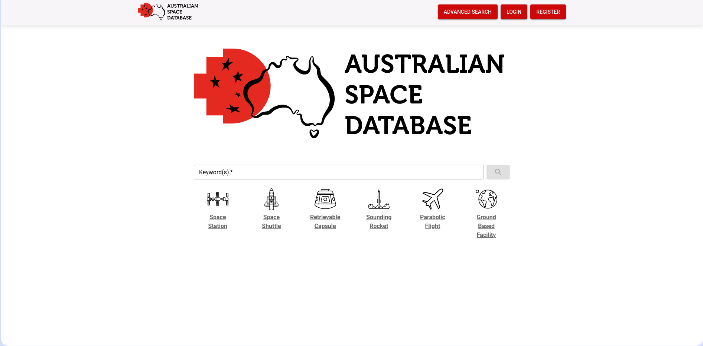
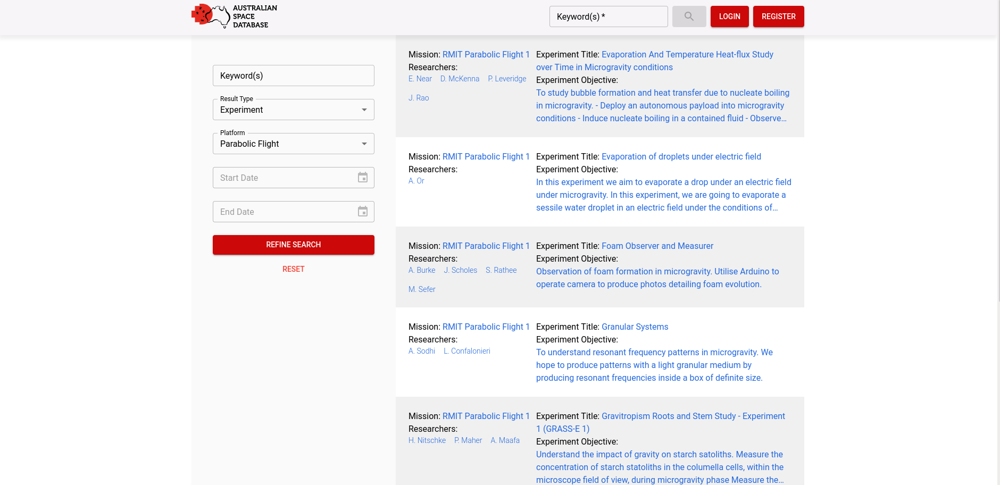
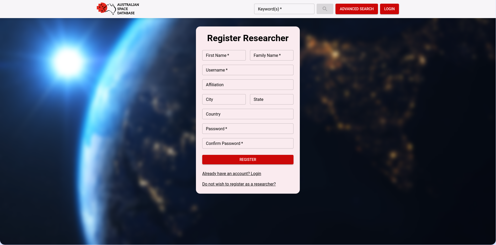
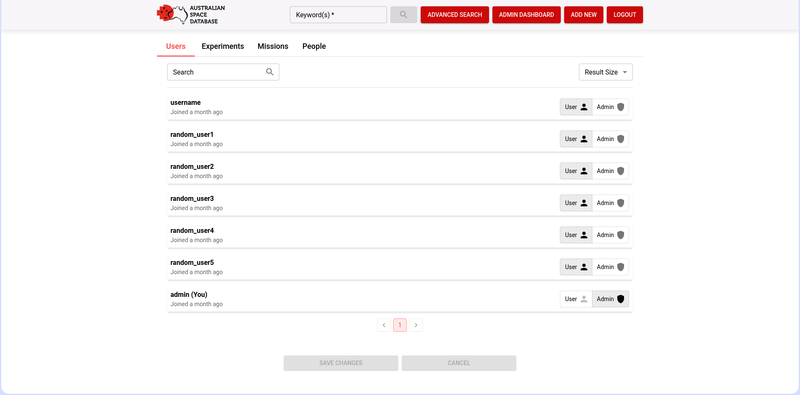

 

    
    <h3 align="center">P000110CSITCP - Australian Space Database</h3>
    

      Online Australian database for microgravity experiments 
       
      <a href="http://131.170.250.223/home"><strong>Explore the website »</strong></a>
    

  
Table of Contents

  <ol>
    <li>
      <a href="#about">About The Project</a>
      <ul>
        <li><a href="#about-team">Team Members</a></li>
        <li><a href="#about-built_with">Built With</a></li>
        <li><a href="#about-features">Features</a></li>
      </ul>
    </li>
    <li>
      <a href="#usage">Usage</a>
      <ul>
        <li><a href="#usage-querying">Querying the Database</a></li>
        <li><a href="#usage-authentication">Registration and Authentication</a></li>
        <li><a href="#usage-administration">Administration</a></li>
      </ul>
    </li>
  </ol>
  

## About The Project

The Australian Space Database is a database search and management website for microgravity experiments conducted within Australia or by Australian research teams. The website was developed as a project by students at RMIT for client Gail Iles.

### Team Members

Solomon Claringbull\
<s3663489@student.rmit.edu.au>

Yong Hui Cheah\
<s3778714@student.rmit.edu.au>

Matthew Ricci\
<s3785111@student.rmit.edu.au>

Andrew Tran\
<s3785952@student.rmit.edu.au>

Shihab Sami\
<s3823710@student.rmit.edu.au>

(<a href="#top">back to top</a>)

### Built With

* [React.js](https://reactjs.org/)
* [Material UI](https://mui.com/)
* [Spring Boot](https://spring.io/projects/spring-boot)
* [MySQL](https://www.mysql.com/)

(<a href="#top">back to top</a>)

 

  
  

    The homepage provides users with a search bar to retrieve results based on keywords as well as platform navigation elements.
  

 

### Features
The website does not require any form of authentication to perform standard queries, however features offerring database modification functionality do require the user to log in to an account with sufficient permissions. 

Features of the Australian Space Database include:

+ Standard user
  + Basic search to perform keyword based queries
  + Advanced search for refining queries based on optional parameters
  + Registration as a researcher or standard account
+ Authenticated user
  + Submission requests for new missions/experiments/people
  + Referencing for people and publications within an experiment
+ Site admin
  + Management dashboard for approving/rejecting/updating new requests
  + Give admin permissions to other users

And much more!

(<a href="#top">back to top</a>)

## Usage 

### Querying the Database
The Australian Space Database offers two options for performing text queries. The basic or keyword search allows users to search records based on the keyword that is entered, while the advanced search offers a more powerful query toolkit with options to refine a search based on a number of fields.

#### Keyword search
Keyword based queries to the database can be performed by using the search bar on the home page, or with the search field in the navigation bar when on any other page. 

This performs a search through all experiments in the database, matching records based on the various available fields such as experiment title and experiment objective.

#### Advanced search

The advanced search can be accessed either by clicking on the button in the navigation bar or through the available platform navigation elements on the home page. Opting to use the platform buttons will redirect the user to the advanced search page with the platform field pre-filled based on which option was selected.

The query elements to the left of the results on this page allow the user to refine their search by filtering results based on a number of optional fields. Users may choose to search for experiments, missions, Fields of Research or Socio-Economic Objectives. Additionally, fields for filtering by experiment platform and date are also available.

 

  
  

    Users may refine their queries with optional parameters on the advanced search page
  

 

(<a href="#top">back to top</a>)

### Registration and Authentication 

Users can register themselves to the website through the form available when clicking on the register button in the navigation bar. By default this will redirect the user to registration for researchers, however an option is available to sign up as a regular user as well. 
Registration as a researcher will automatically create a person entry in the database, allowing them to be added to experiments.

Once registered, the user can log in through the form available when the user clicks on the login button in the navigation bar.

 

  
  

    Users by default are redirected to the researcher registration form
  

 

(<a href="#top">back to top</a>)

### Administration

 

  
  

  Admins can manage the database through the dashboard
  

 

When logged in as an admin, users are able to manage incoming requests for records inserted into the database. The admin is able to approve, modify, or reject these requests upon reviewing their content. 

The admin also has the ability to grant users admin privileges.

(<a href="#top">back to top</a>)

